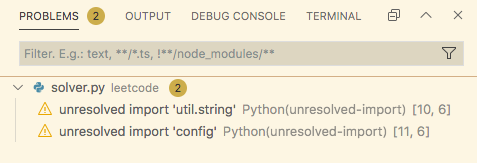

# VS Code编辑Python文件提示`unresolved import`的解决方案

## 问题描述

当使用VS Code打开一个Python项目的文件夹，如果自己编写的模块的源文件不是位于项目根目录（即：${workspaceFolder}）时，会出现找不到模块目录的情况，使得`Go to Definition`功能也变得不可用，并且这时编辑`terminal.integrated.env`变量和`python.envFile`变量都没有用.



## 解决方案

其中一种解决方案是编辑项目文件夹下的`.vscode/setting.json`，打开后会看到一个`JSON`文件，在里面添加一个键`python.autoComplete.extraPaths`，如下

```
{
    // ... 其他VS Code项目级别设置
    "python.autoComplete.extraPaths": [
        // ${workspaceFolder} 并不能产生效果，要使用绝对目录
        "/Path/to/custom/module/path"
    ]
}
```

修改完成后记得重新加载窗口.

## 补充

下面是使用VS Code可能偶尔需要修改的文件：

- `${workspaceFolder}/.vscode/setting.json` 项目级别的配置文件
- `${workspaceFolder}/.vscode/launch.json` 和`debug`有关

其他的系统级别的配置文件和具体的操作系统有关.

## 参考资料

[1] [Editing Python in Visual Studio Code](https://code.visualstudio.com/docs/python/editing#_autocomplete-and-intellisense)